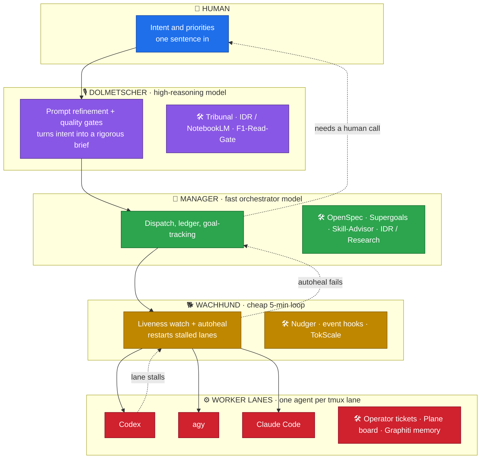

# agent-orchestration

How one operator runs a fleet of AI coding agents — a five-layer orchestration model that turns a
single human intent into verified, shipped work across many parallel agent lanes.

This repo is a **showcase of the method**, not the private infrastructure. Internal-only tools are
described but not linked; every linked tool below is public.

## The five layers

**Escalation path:** a worker lane that stalls is first re-nudged and auto-healed by the Wachhund
(cheap 5-minute loop); if auto-heal fails, the Manager re-plans; only a genuine judgement call goes
back up to the human. Each layer runs the cheapest model that can do its job — expensive reasoning
only where it changes the outcome.

## Tools & methods

| Tool / Method | Layer | What it does | Why | Link |
|---|---|---|---|---|
| **Tribunal** (3 types + persona library) | Dolmetscher | 3 independent judge personas hard-critique a plan/output across rounds behind evidence gates | Kills plausible-but-wrong work before it ships | internal tooling, method described |
| **IDR — Interactive Deep Research** | Dolmetscher / Manager | Structured multi-source research grounded in a shared notebook of sources | Decisions backed by real evidence, not vibes | [NotebookLM](https://notebooklm.google.com) |
| **Supergoals** | Manager | Goal-tracking that enforces dispatched work actually completes (phases + verifiers) | Stops "said done, wasn't done" | [robzilla1738/supergoal](https://github.com/robzilla1738/supergoal) |
| **LazyCodex** | Worker | Lightweight wrapper that keeps cheap engines on-task in long loops | Cost control | internal tooling, method described |
| **OpenSpec** | Manager | Spec-driven change workflow: proposal + tasks + acceptance, strict-validated before work | Every change is a checkable contract | internal adaptation, method described |
| **TokScale** | Wachhund | Per-agent usage and cost tracking, surfaced on dashboards | See burn per lane in real time | [junhoyeo/tokscale](https://github.com/junhoyeo/tokscale) |
| **Plane** | Worker | Kanban UI mirroring ticket state across columns | Human-legible board over the fleet | [makeplane/plane](https://github.com/makeplane/plane) |
| **Operator** | Worker | Control-plane: heartbeat, ticket lifecycle, lane spawning with dedup / rate / resource guards | One place that owns who and when | internal tooling, method described |
| **Wachhund / Nudger** | Wachhund | 5-min liveness loop; nudge with backoff 1×→5min→15min→red | Self-healing without human babysitting | internal tooling, method described |
| **Skill-Router + Skill-Advisor** | Manager | Scans skill catalogs, recommends the right skill per task | Right capability, less guessing | internal tooling, method described |
| **Event-hook escalation** (lane-stop hook) | Wachhund | On a lane-stop event: auto-heal → re-plan → escalate up one layer | Failures surface fast, never silently | internal tooling, method described |
| **Report-integrity guard + anti-fake pre-commit gate** | Manager | Pre-commit gate that rejects fake-green / unverifiable "done" claims | Evidence culture enforced mechanically | internal tooling, method described |
| **Feature-Matrix Standard** | Dolmetscher | Emoji CSV matrix: real repo links + stars, exactly one 👑 crown, explicit score provenance | Scannable, honest, sourced comparisons | internal method, described |
| **cmux** | Worker | Multiplexed agent / terminal session control | Parallel lane control | internal tooling, method described |
| **Engine tiers** | Meta (all layers) | Fast model → Manager; Codex/LazyCodex → Worker (supergoals); free model → research; strongest model → high-stakes work | Cheapest capable engine per role | internal method, described |
| **Caveman briefs** | Manager → Worker | Lean, low-context pointer-briefs (link, don't inline) | Less context burn per dispatch | internal method, described |
| **Memory system** | Worker | File-based memories + a MEMORY index, moving toward graph memory | Agents recall prior context across sessions | [getzep/graphiti](https://github.com/getzep/graphiti) (direction) |
| **tmux lanes** | Worker | One agent per persistent tmux session | Cheap, inspectable parallelism | [tmux/tmux](https://github.com/tmux/tmux) |
| **F1-Read-Gate** | Dolmetscher | Nothing is "done" without a read-and-proof gate | Evidence culture, no fake-green | internal method, described |
| **2-Verifier E2E** | Manager | Two independent verifiers must pass before a goal closes | Catches single-agent blind spots | internal method, described |

## Examples

Sanitized, synthetic walk-throughs of two core methods (no private content):

- **[IDR report](./examples/example-idr.md)** — header format, NotebookLM workflow, a comparison
  matrix (synthetic tools, real-star convention, exactly one 👑 crown), and the proof/counter-delta.
- **[Codex Tribunal run](./examples/example-codex-tribunal.md)** — three judge personas, evidence-gated
  rounds, and a synthesized verdict on a generic board-UI + git-sync architecture.

## Principles

- **Cheapest capable model per layer.** Reasoning-heavy work at the top, mechanical work below.
- **Evidence over claims.** Real command output / artifacts gate every "done" (F1-Read-Gate).
- **Self-healing before escalation.** The Wachhund fixes most stalls; humans see only real decisions.
- **Specs are contracts.** OpenSpec changes are strict-validated before work starts.
- **One agent, one lane.** Parallelism is inspectable tmux sessions, not a black box.

## License

[MIT](./LICENSE)
